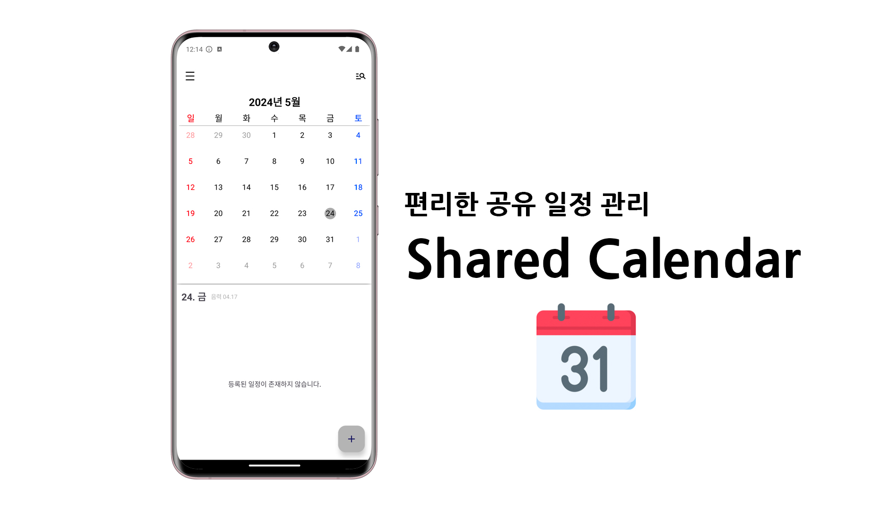
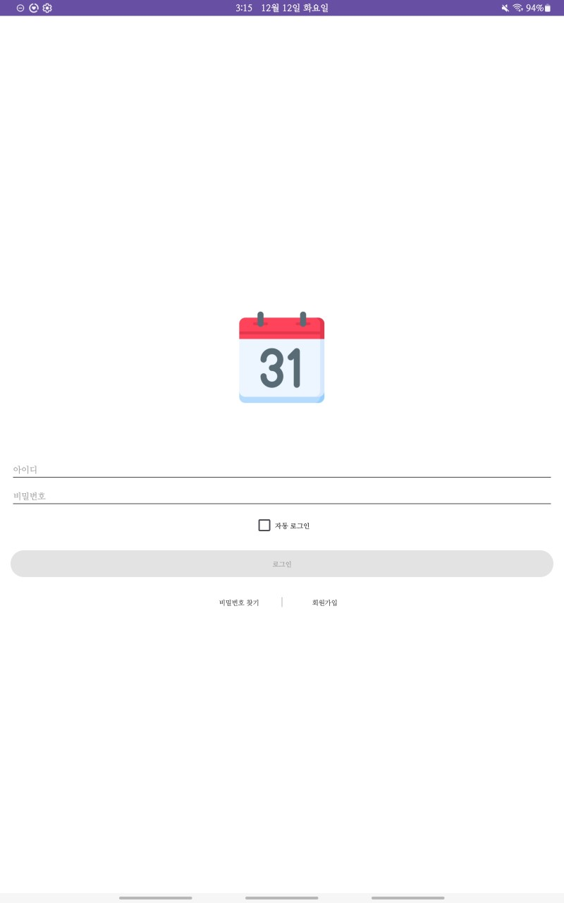
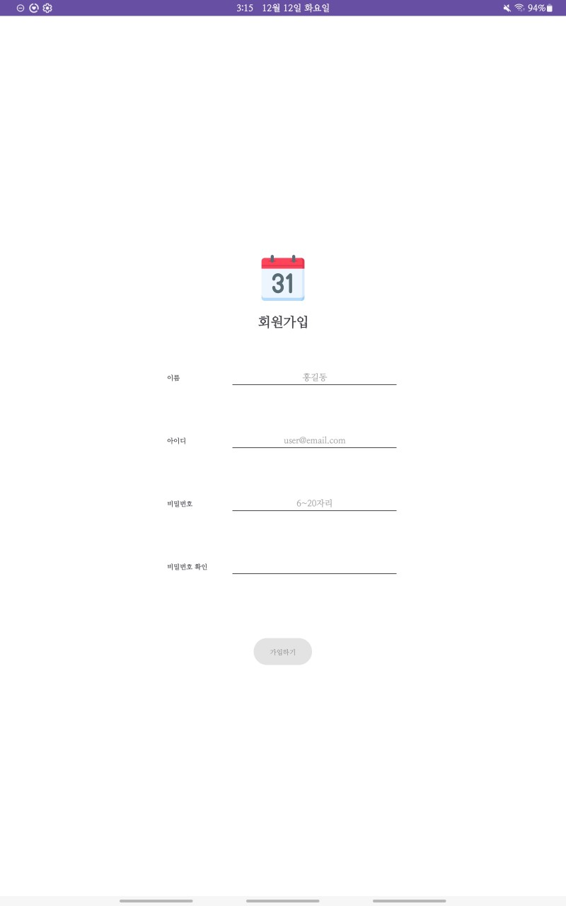

<!-- 프로젝트 제목 -->
# Shared Calendar  

    
    
편리한 공유 일정 관리가 가능한 공유 캘린더 앱

 

<!-- 프로젝트 개요 -->
## 프로젝트 개요  
"Shared Calendar"는 협업을 위한 미팅 등의 일정을 서로 공유하며 관리할 수 있는 캘린더입니다. 미팅을 잡아놨지만 까먹고 참석하지 못하는 경우 등을 예방하는 목적에서 시작되었습니다. 팀원 누군가가 일정을 등록하면 등록 알림이 전송되고, 예정된 시간이 되면 알림이 전송되어 일정을 까먹지 않을 수 있게 됩니다.  

### 프로젝트 기간  
* 2023.10 ~ 2023.12  

### 개발 환경  
* Android Studio  
* Kotlin  
* Firebase  
  * Firebase Auth  
  * Firebase Realtime Database  

 

<!-- 프로젝트 상세 -->
## 상세 기능  
### 1. 로그인 및 회원가입 화면   
| 로그인 화면 | 회원가입 화면 |
|----------|------------|
|||
* '자동 로그인'에 체크하는 경우 다음 실행 때는 로그인 없이 바로 메인 화면으로 이동  
* 유효한 이메일 인증을 위해 **Firebase Auth**로 이메일 인증  

### 2. 메인 화면 및 일정 추가 화면  
| 메인 화면 | 일정 추가 화면 |
|---------|-------------|
|||  

| 색상 선택 전 | 색상 선택 후 | 
|-----------|------------|
|||

| 알림 설정 | 알림 울림 |
|---------|---------|
|||
* 좌우 스와이프를 통해 이전달, 다음달 이동 가능  
* 우측 하단 + 버튼을 눌러 새로운 일정 추가 가능  
* 추가되는 일정은 **Firebase Realtime Database**에 저장
* 일정의 특성별로 관리하기 위해 색상 설정 가능  
  * 현재 선택된 색상을 기준으로 상단바의 색상이 변경  
* 미리 설정된 시간을 기준으로 일정 시작 시간 전에 울릴 알림 설정 가능  

### 3. 일정 수정 화면  
| 일정 수정 화면 |
|-------------|
||
* 메인 화면에서 특정 일정 선택 시 수정 가능  
* 수정은 최초 일정 등록자와 관계 없이 누구든지 가능  
* 일정을 수정할 경우 **최종 수정**에 표시되는 이름이 현재 사용자의 이름으로 갱신  
* 수정이 완료되면 알림 전송  

### 4. 일정 삭제 화면  
| 일정 삭제 전 | 일정 삭제 후 |
|-----------|-----------|
|||
* 일정 삭제는 **최초 등록자**만 가능  
* 삭제 완료 시 알림 전송  

### 5. 좌측 메뉴 화면  
| 메뉴 화면 | 회원 탈퇴 |
|---------|---------|
|||
* '로그아웃'하면 로그인 화면으로 이동되고, 자동 로그인이 설정되었다면 해제로 변경  
* 회원 탈퇴 시 DB에서 즉시 삭제되며 로그인 화면으로 이동  
  * 해당 사용자가 등록한 일정도 모두 삭제